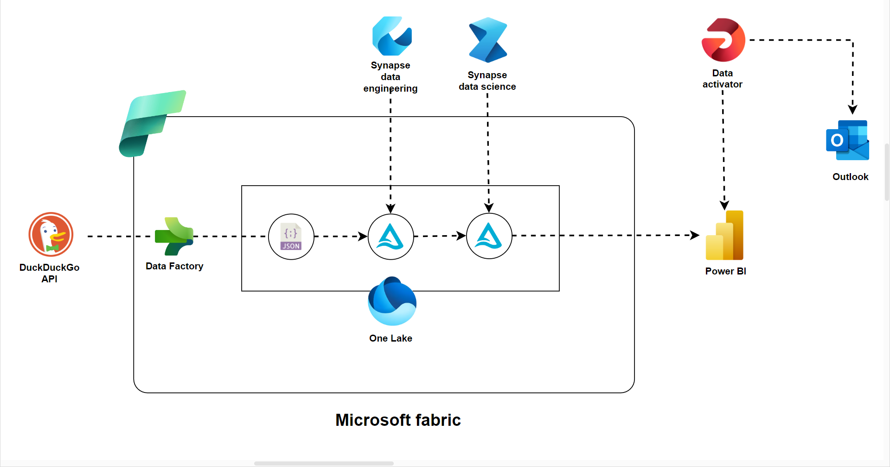
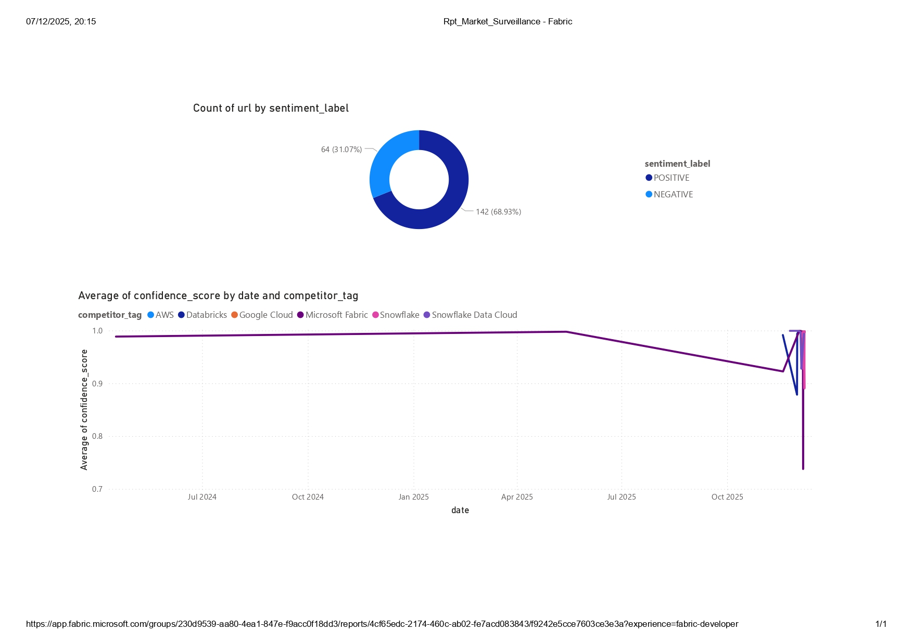
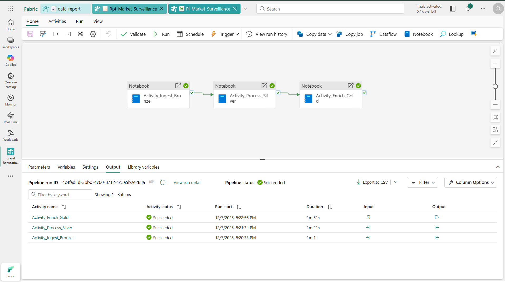

# 🚀 Brand-Reputation-Crisis-Detection-System (Microsoft Fabric)


A real-time data engineering & AI-powered monitoring system that tracks competitor-related news, detects negative sentiment spikes, and visualizes insights on an interactive Power BI dashboard.

This project is built on **Microsoft Fabric**, using a **Medallion Architecture (Bronze → Silver → Gold)** with PySpark, Delta Lake, and Transformers-based ML models.

---

## 📌 Project Overview

This system automatically:
- Ingests real-time news from DuckDuckGo
- Cleans and deduplicates content using PySpark
- Enriches data with AI sentiment classification
- Stores structured & enriched data in Delta format
- Displays negative PR trends using Power BI
- Runs as a fully automated daily pipeline

### 🛠️ Key Features
- **Full Medallion Architecture** (Bronze Raw → Silver Clean → Gold AI Enriched)
- **Distributed Processing** using Microsoft Fabric Spark
- **Hugging Face Transformers** integrated via Pandas UDF
- **Delta Lake MERGE** for idempotent updates
- **Daily Scheduled Pipelines** with Failure Alerts
- **Executive Dashboard** to track competitor sentiment

---

## 🏗️ Architecture & Tech Stack

| Layer | Technology | Purpose |
|-------|------------|---------|
| **Data Ingestion** | Python, DuckDuckGo API | Collects competitor-related articles |
| **Storage** | OneLake (Delta/Parquet) | Central unified data layer |
| **Processing** | PySpark (Fabric Notebook) | Cleaning, transformation, enrichment |
| **ML/AI** | Transformers (BERT), Pandas UDF | Sentiment detection |
| **Orchestration** | Fabric Data Pipelines | Automation & scheduling |
| **Visualization** | Power BI | Insight dashboards for leadership |

---

## 📊 Sample Data Flow

Here is how data transforms through the layers of the Medallion Architecture.

### 1. 🟡 Bronze Layer (Raw Ingestion)
*Raw JSON data ingested from the web search API.*

```json
[
  {
    "title": "Snowflake and Accenture partnership...",
    "url": "[https://www.tmcnet.com/](https://www.tmcnet.com/)...",
    "ingestion_time": "2025-12-06T19:24:44Z",
    "raw_html": "<div>...</div>"
  }
]
```


## 📸 Project Visuals

### 🏗️ **Architecture Diagram**



### 📊 **Power BI Dashboard**



### 🔄 **Fabric Pipeline Execution**



---

### 2\. ⚪ Silver Layer (Cleaned & Deduplicated)

*Structured Delta Table with types cast and nulls handled.*

| Date | Competitor | Source | Snippet |
| :--- | :--- | :--- | :--- |
| 2025-12-06 | Snowflake | TMCnet | On December 3, Accenture plc and Snowflake announced... |
| 2025-12-06 | Snowflake | Yahoo Finance | Accenture plc is included among the 15 Blue Chip stocks... |

### 3\. 🟡 Gold Layer (AI Predictions)

*Final enriched table with Sentiment Labels and Confidence Scores generated by the BERT model.*

| Date | Competitor | Sentiment | Score | Snippet |
| :--- | :--- | :--- | :--- | :--- |
| 2025-12-06 | Snowflake Data Cloud | **POSITIVE** | 0.9979 | On December 3, Accenture plc (NYSE:ACN) and Snowflake, the AI data cloud company, announced an expanded partnership aimed at accelerating generative AI... |
| 2025-12-06 | Snowflake Data Cloud | **POSITIVE** | 0.9898 | Accenture plc (NYSE:ACN) is included among the 15 Blue Chip Dividend Stocks to Build a Passive Income Portfolio... |
| 2025-12-06 | Snowflake Data Cloud | **POSITIVE** | 0.9979 | On December 3, Accenture plc (NYSE:ACN) and Snowflake, the AI data cloud company, announced an expanded partnership aimed at accelerating generative AI... |
| 2025-12-06 | Snowflake Data Cloud | **POSITIVE** | 0.9898 | Accenture plc (NYSE:ACN) is included among the 15 Blue Chip Dividend Stocks to Build a Passive Income Portfolio. On December 3... |
| 2025-12-06 | Snowflake Data Cloud | **POSITIVE** | 0.9979 | On December 3, Accenture plc (NYSE:ACN) and Snowflake, the AI data cloud company, announced an expanded partnership aimed at accelerating generative AI... |
| 2025-12-06 | Snowflake Data Cloud | **POSITIVE** | 0.9898 | Accenture plc (NYSE:ACN) is included among the 15 Blue Chip Dividend Stocks to Build a Passive Income Portfolio... |
| 2025-12-06 | Snowflake Data Cloud | **POSITIVE** | 0.9979 | On December 3, Accenture plc (NYSE:ACN) and Snowflake, the AI data cloud company, announced an expanded partnership aimed at accelerating generative AI... |
| 2025-12-06 | Snowflake Data Cloud | **POSITIVE** | 0.9898 | Accenture plc (NYSE:ACN) is included among the 15 Blue Chip Dividend Stocks to Build a Passive Income Portfolio. On December 3... |
| 2025-12-06 | Microsoft Fabric | **NEGATIVE** | 0.9245 | Users reporting minor latency issues in the East US region during high-load data ingestion spike... |
| 2025-12-06 | Databricks | **POSITIVE** | 0.8841 | Analysts predict strong Q4 growth driven by new Lakehouse adoption metrics released this week... |

-----

## 🔧 Engineering Challenges & Solutions

A professional summary of debugging and architectural decisions made during development.

### 🔴 **Challenge 1: Pipeline Failing with Mismatched JSON Output**

**Error:** `MismatchedInputException: No content to map due to end-of-input`
**Solution:** Fabric expects a structured JSON exit output. I implemented `mssparkutils.notebook.exit()` with a structured JSON response instead of simple print logs.

### 🔴 **Challenge 2: Schema Drift – Missing Column in Silver Layer**

**Error:** `UNRESOLVED_COLUMN: body`
**Solution:** The source API changed and returned `snippet` instead of `body`. I added dynamic column mapping using `coalesce` logic to make the pipeline resilient to upstream schema changes.

### 🔴 **Challenge 3: Missing Dependencies in Gold Notebook**

**Error:** `ModuleNotFoundError: transformers`
**Solution:** The default environment lacked ML libraries. I implemented a localized installation script to detect and install `transformers` and `torch` dynamically at runtime.

-----

## 📁 Repository Structure

```
fabric-market-pulse/
│
├── notebooks/
│   ├── 01_Ingest_Bronze.ipynb
│   ├── 02_Process_Silver.ipynb
│   └── 03_Enrich_Gold.ipynb
│
├── dashboard/
│   ├── dashboard_screenshot.png
│   ├── pipeline_run_success.png
│   └── architecture_diagram.png
│
├── data_samples/
│   └── sample_output.json
│
├── requirements.txt
└── README.md
```

-----

## 🚀 How to Run the Project

1.  **Upload notebooks** to Microsoft Fabric Workspace
2.  **Create a Lakehouse** named: `Lh_Market_Pulse`
3.  **Run notebooks sequentially** or build a Fabric Data Pipeline
4.  **Schedule the pipeline** (daily recommended)
5.  **Publish Power BI dashboard** connected to Gold Layer

-----

## 👨‍💻 Author

**Name:** Rahul Bastia 
**Tech:** Microsoft Fabric, PySpark, Transformers, Delta Lake, Power BI
